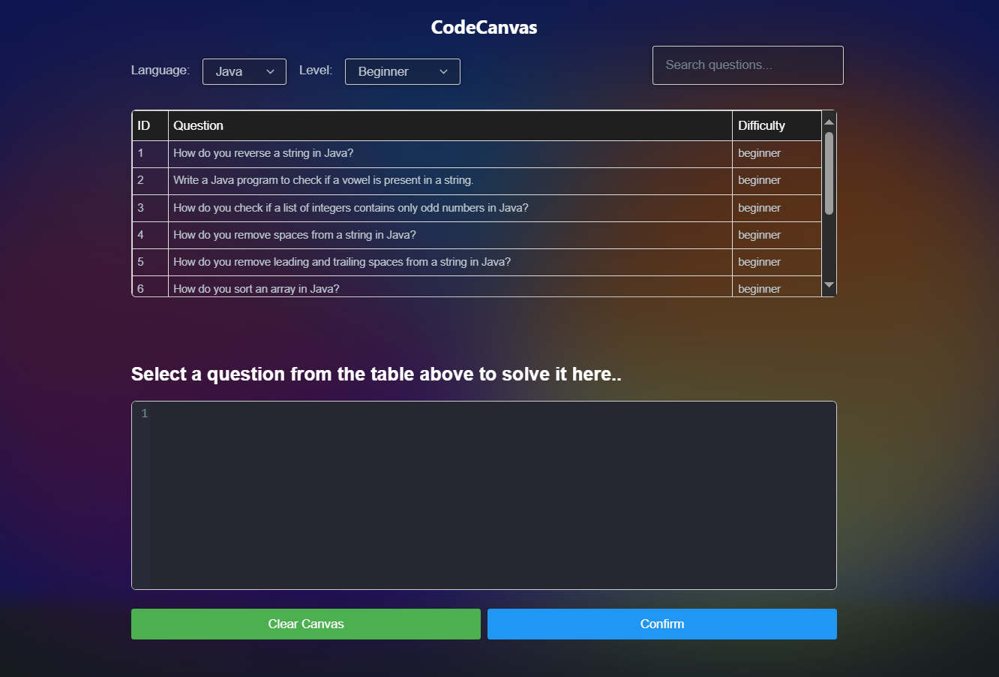

# PathwayPro

PathwayPro is an innovative platform designed to help software engineers excel in technical interviews. Featuring AI-driven mock interviews, an extensive library of practice questions, and an integrated code editor with live testing and feedback, PathwayPro provides everything you need to prepare for coding challenges and technical rounds.





## Features

- **AI-Driven Interviews**  
  Engage in simulated technical interviews with PathwayBot, providing personalized feedback and suggestions for improvement.

- **Practice Questions**  
  Access a curated library of coding problems covering data structures, algorithms, and system design.

- **Integrated Code Editor**  
  Solve problems directly within the platform using a built-in editor that supports Java and Python (more languages coming soon).  

- **Live Feedback**  
  Receive real-time test case evaluations and insights from PathwayBot.

- **Multi-Language Support**  
  Currently supports Java and Python, with plans to expand to more programming languages.

## Tech Stack

- **Frontend**: HTML, CSS, JavaScript  
- **Backend**: Python
- **Code Editor**: Customized integration supporting syntax highlighting and real-time execution  

## Setup and Installation

### Prerequisites
- [Python](https://www.python.org/) (for backend)

### Steps

1. **Clone the Repository**  
   ```bash
   git clone https://github.com/Lahiru20/PathwayPro.git
   cd PathwayPro
   ```

2. **Frontend Setup**  
   Navigate to the frontend directory and open the `index.html` file in your browser to run the frontend.

3. **Backend Setup**  
   If using Python:
   ```bash
   cd backend
   python -m venv venv
   source venv/bin/activate  # On Windows use `venv\Scripts\activate`
   pip install -r requirements.txt
   python app.py
   ```

   If using Spring Boot:
   ```bash
   cd backend
   ./gradlew bootRun
   ```

5. **Start the Application**  
   Open the `index.html` file in your browser and ensure the backend server is running for full functionality.
